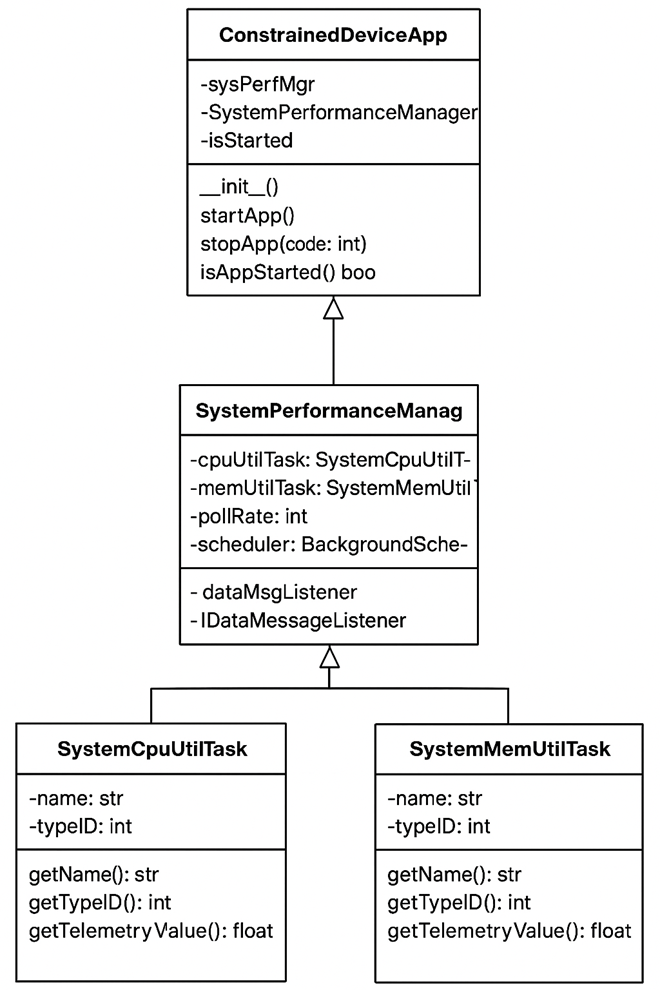

# Constrained Device Application (Connected Devices)

## Lab Module 02

Be sure to implement all the PIOT-CDA-* issues (requirements) listed at [PIOT-INF-02-001 - Lab Module 02](https://github.com/orgs/programming-the-iot/projects/1#column-9974938).

### Description

NOTE: Include two full paragraphs describing your implementation approach by answering the questions listed below.

What does your implementation do? 
The implementation of the Constrained Device Application (CDA) monitors and manages system performance metrics on IoT or constrained devices. It collects CPU and memory utilization data through the SystemPerformanceManager, logs the results, and allows the application to run either for a fixed duration or continuously. The design is modular, enabling future extensions such as additional telemetry tasks or integration with IoT messaging systems, while also handling exceptions and interruptions gracefully.

How does your implementation work?
The CDA works by initializing the SystemPerformanceManager, which creates CPU and memory utility tasks using the psutil library to collect telemetry. A background scheduler periodically calls handleTelemetry() to log CPU and memory usage. The application is started via startApp(), activating the scheduler, and stopped via stopApp(), which shuts down the scheduler cleanly. Unit tests verify that telemetry values are collected correctly and the CDA can run and stop without errors, ensuring a reliable and modular framework for constrained device monitoring.

### Code Repository and Branch

NOTE: Be sure to include the branch (e.g. https://github.com/programming-the-iot/python-components/tree/alpha001).

URL: https://github.com/Mensah-er/cda-python-components/tree/labmodule02

### UML Design Diagram(s)

NOTE: Include one or more UML designs representing your solution. It's expected each
diagram you provide will look similar to, but not the same as, its counterpart in the
book [Programming the IoT](https://learning.oreilly.com/library/view/programming-the-internet/9781492081401/).

### Unit Tests Executed

NOTE: TA's will execute your unit tests. You only need to list each test case below
(e.g. ConfigUtilTest, DataUtilTest, etc). Be sure to include all previous tests, too,
since you need to ensure you haven't introduced regressions.

- test_ConfigUtilDefault
- test_ConfigUtilCustom
- test_SystemCpuUtilTask
- test_SystemMemUtilTask

### Integration Tests Executed

NOTE: TA's will execute most of your integration tests using their own environment, with
some exceptions (such as your cloud connectivity tests). In such cases, they'll review
your code to ensure it's correct. As for the tests you execute, you only need to list each
test case below (e.g. SensorSimAdapterManagerTest, DeviceDataManagerTest, etc.)

- test_ConstrainedDeviceApp
- test_SystemPerformanceManager
EOF.
